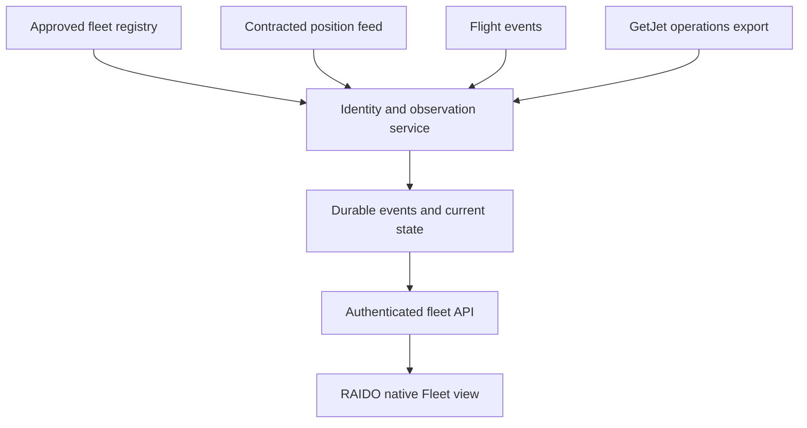

# GetJet fleet tracking for RAIDO

Research and repository audit • 5 September 2026

## Decision

Use a shared, continuously running service with three separate data lanes: aircraft observations, flight operations, and company technical status. Keep every approved fleet member visible even when its transponder is silent. Show the age and provenance of each fact. A public tracker cannot establish that an aircraft is serviceable, in maintenance, or AOG.

For RAIDO, the practical production candidate is **FlightAware AeroAPI for flight events and aircraft assignments**, with its position coverage measured against GetJet operations before choosing the position contract. Evaluate **ADSB Exchange enterprise** and **FlightAware Premium with Aireon** when the initial coverage is insufficient. Keep the existing ADSB.lol integration as a prototype while contracts and coverage are evaluated. Combining feeds requires compatible written permissions.

**Do not implement Flightradar24 as a fallback to ADSB.lol.** Its current API terms explicitly prohibit supplementing or backfilling another near-time or real-time provider, for commercial and non-commercial use. A separate agreement would be needed for that architecture. Its public API also does not currently provide future schedules. [FR24 terms, section 6.3.1.1.3](https://www.flightradar24.com/terms-of-service), [API FAQ](https://fr24api.flightradar24.com/docs/faq)

No provider was live-benchmarked across GetJet aircraft in this research. The recommendations are based on the inspected application, primary documentation, API schemas, licensing, and source code. They are not a measured coverage guarantee.

## 1. What the GitHub project actually does

Inspected repository: `bobanilic/RAIDORoster-iOS`, main commit `4dacf80a9b9731c29f179ae4805059183c437aec`. The latest inspected release is 2.19.7. Its GitHub Actions build succeeded on 4 September 2026. [Repository at inspected commit](https://github.com/bobanilic/RAIDORoster-iOS/tree/4dacf80a9b9731c29f179ae4805059183c437aec), [successful build](https://github.com/bobanilic/RAIDORoster-iOS/actions/runs/33824196024)

The checked-in `ContentView.swift` is not the final application. `build-unsigned-ipa.sh` runs 60 Python patches before Xcode compiles it. I reconstructed that generated source before auditing Fleet. Editing only the old Swift file would miss or conflict with later patches.

| Existing behavior | Reliability consequence | Proposed PR treatment |
|---|---|---|
| Static list of 19 aircraft | Fleet membership is not continuously reconciled | Preserve existing membership; provide the evidence table below |
| One ADSB.lol request per registration, sequentially; 8-second timeout | A slow sweep can take about 152 seconds before route enrichment | Keep current transport for this first change; move polling to shared service next |
| Refresh every 120 seconds while Fleet is open | No continuous history when the app is closed | Explicit backend requirement |
| Accepts the first returned aircraft | Wrong or stale identity can be attached to a tail | Match registration and validated cached ICAO hex |
| Position age uses `max(elapsed + seen, seen_pos)` | Old coordinates can look fresh after unrelated messages arrive | Add elapsed time to both ages and require a known position timestamp |
| Missing altitude becomes `onGround = false` | Unknown state may be interpreted as airborne | Preserve unknown ground state |
| HTTP failures often become an empty response | Outage and no reception become indistinguishable | Count non-success responses; respect 429 backoff |
| Callsign standing-data lookup supplies route | A plausible route is not today's confirmed flight | Require positive plausibility and label inferred routes |
| Phase inferred from altitude changes without elapsed time | Climb/descent misclassification | Use vertical rate or a bounded, timed altitude difference |
| Ground/air transitions across arbitrary history gaps | Reopening the app can invent a takeoff or landing | Require known, contiguous observations with matching callsigns |
| First assigned tail gets a special row; all assigned tails removed below | Other assigned aircraft disappear | Render every assigned tail |
| Detail view receives value snapshots | Open detail can stop reflecting refreshes | Observe the live store and tick age labels |
| Today uses message age and can extrapolate 120 seconds | Smooth motion can hide old coordinates | Use position age; limit projection to 20 seconds; reset on tail switch |

The existing UI correctly says that no ADS-B signal does not prove AOG. Preserve that distinction. The new patch is appended to the current build pipeline to minimize disruption; replacing the entire patch architecture is a separate project.

## 2. Define “all GetJet aircraft” before tracking

The sources disagree. GetJet's own website currently advertises **17 aircraft: 11 A320, one A321, five 737-800**. The app has 19. FR24's GetJet airline fleet page lists 13, including two tails absent from both the official list and app. These lists represent different membership evidence, not an established total of active aircraft. [GetJet fleet](https://getjet.aero/), [FR24 GetJet fleet](https://www.flightradar24.com/data/airlines/gw-gjt/fleet)

| Registration | Type | MSN from GetJet | Evidence on 5 September 2026 |
|---|---|---:|---|
| LY-NOW | A320 | 4328 | Official website; existing app |
| LY-GYM | A320 | 2584 | Official website; existing app |
| LY-FAS | A320 | 4273 | Official website; existing app |
| LY-WIL | A320 | 3138 | Official website; existing app |
| LY-MAL | A320 | 3068 | Official website; existing app |
| LY-WIZ | A320 | 3430 | Official website; existing app |
| LY-CAP | A320 | 2768 | Official website; existing app |
| 9H-GTS | A320 | 4384 | Official website; app identifies Airhub |
| LY-TAP | A320 | 2842 | Official website; existing app |
| LY-EKB | A320 | 5348 | Official website; existing app |
| LY-DAE | A320 | 3240 | Official website; existing app |
| LY-WSA | A321 | 2115 | Official website; existing app |
| LY-UNO | B737-800 | 33801 | Official website; existing app |
| LY-DUE | B737-800 | 33996 | Official website; existing app |
| LY-CIN | B737-800 | 28247 | Official website; existing app |
| LY-TUI | B737-800 | 33974 | Official website; existing app |
| LY-SEI | B737-800 | 32692 | Official website; existing app |
| LY-FOX | A320 | Unverified here | Existing app and FR24; absent from official list |
| LY-TEN | A320 | Unverified here | Existing app and FR24; absent from official list |
| LY-ELM | A320 | Unverified here | FR24 candidate; absent from app and official list |
| LY-KUA | B737-800 | Unverified here | FR24 candidate; absent from app and official list |

Official aircraft details: [A320](https://getjet.aero/airbus-a320/), [A321](https://getjet.aero/airbus-a321/), [737 NG](https://getjet.aero/boeing-737-ng/).

Treat this as **17 official-site entries plus four candidates requiring reconciliation**. Do not announce a 21-aircraft active fleet. The official website itself includes the Maltese-registered 9H-GTS; GetJet group membership, AOC operator, ownership, and wet-lease customer must be separate fields. An aircraft flying a customer's callsign remains a fleet member. Filtering only `GJT` callsigns will miss wet-lease work.

Create a versioned fleet registry with a stable aircraft ID, manufacturer/MSN, registration validity interval, ICAO 24-bit address validity interval, AOC operator, lease customer, membership state, source, and verification date. Obtain the initial approved inventory from GetJet. No authoritative hex list was established during this research; do not fill those values with guesses. Registration and transponder address changes should produce a reconciliation task, not silently transfer old history.

## 3. What each status can actually mean

| Requested status or fact | Suitable evidence | What does not establish it |
|---|---|---|
| Last reported position, altitude, speed, track | Timestamped ADS-B/MLAT or contracted tracking observation | Time the phone fetched a cached response |
| Airborne / ground | Fresh explicit ground flag or valid altitude evidence | Missing altitude, missing signal |
| Climbing / descending / level | Fresh vertical rate; otherwise timed consecutive samples | Altitude difference with no elapsed time |
| Assigned next flight | Company operations or flight-status provider, including tail changes | Previous callsign route |
| Scheduled / delayed / cancelled / diverted | Flight-status events or company movement record | Absence from a live-position endpoint |
| Runway takeoff / landing time | Published actual off/on times; otherwise labelled observation estimate | Disappearance near an airport |
| Off-block / on-block time | Company MVT or provider actual out/in event | ADS-B ground transition |
| Turnaround | Explicit definition using on-block to next off-block | Time since the first ground observation |
| Maintenance / AOG / return to service | Authorized company technical status with validity period | Long parking, no flights, maintenance-airport proximity |
| Dispatchable | Authorized operational/technical release state | Any public tracker |

Keep three independent state axes in the UI. For example, an aircraft can have a last observation of “on ground,” a flight “delayed,” and technical status “unknown.” A missing technical feed should produce “Technical status unavailable,” never “Serviceable.” An old position remains visible with its timestamp and cannot become a current status simply because the backend is healthy.

## 4. Provider assessment

### ADSB.lol: useful existing prototype feed

The published API is open under ODbL 1.0. Its source exposes registration and hex lookup; the response model distinguishes `seen` from `seen_pos` and includes integrity and accuracy fields. The project documents dynamic rate limiting. Do not assume a fixed unlimited production allowance or SLA. Attribute the source and review database obligations before mixing or distributing data. [Open-data API](https://www.adsb.lol/docs/open-data/api/), [API repository](https://github.com/adsblol/api)

Its routeset implementation uses callsign and position against standing route data. Geometry plausibility improves an inference but does not supply a dated schedule, cancellation, or verified aircraft assignment. Multi-registration batch syntax was not established by a successful live request here; production batching must use an endpoint explicitly supported by the selected provider. [Lookup implementation](https://github.com/adsblol/api/blob/main/src/adsb_api/utils/api_v2.py), [routes implementation](https://github.com/adsblol/api/blob/main/src/adsb_api/utils/api_routes.py)

### FlightAware: strongest practical first trial for operations

AeroAPI combines flight information, positions and event alerts. Personal plans are for personal/academic use; Standard supports relevant business/internal and consumer application use, with a **$100 monthly minimum**, while Premium has a **$1,000 monthly minimum** and a published 99.5% service uptime guarantee. Aireon and Foresight are Premium options that require enablement. Minimums are not an unlimited usage bundle. Confirm the exact app use case and rights before subscribing. [AeroAPI plans and prices](https://www.flightaware.com/commercial/aeroapi/)

Use registration-based discovery to resolve the appropriate flight instance, then store `fa_flight_id`. Do not equate a recurring callsign with a unique flight. The schema distinguishes scheduled, estimated and actual `out`, `off`, `on`, and `in` times. Many fields are nullable. Some position/search responses do not supply registration, so discovery and position polling cannot be substituted blindly. Prefer alerts/webhooks for changes, with reconciliation polling for missed events. [Official OpenAPI schema](https://static.flightaware.com/rsrc/aeroapi/aeroapi-openapi.yml)

FlightAware describes multiple terrestrial and space-based inputs. Global satellite coverage describes geographic capability, not guaranteed reception from every aircraft at every moment. Verify GetJet ground reception, tail assignments, schedule coverage, and permitted caching in the trial. [Data sources](https://uk.flightaware.com/commercial/data/)

### ADSB Exchange: enterprise position-feed candidate

Enterprise products offer fleet/global access and configurable data delivery cadence; pricing is quoted with annual commitments. Community/personal access is not the default license for a business fleet app. A documented enterprise endpoint accepts a comma-separated set of ICAO hex addresses using an `api-auth` header, making a shared fleet poller practical. [Data products](https://www.adsbexchange.com/data-products/), [sample API call](https://www.adsbexchange.com/data-products/sample-api-call/)

The v2 schema distinguishes message age from position age, ADS-B from MLAT and other position types, and accuracy/integrity metadata. `rc` is containment information, not a guaranteed ± positioning error. Reject stale nested positions as current observations. Documentation and examples differ in epoch representation, so adapters must test seconds and milliseconds explicitly. [Version 2 API](https://www.adsbexchange.com/version-2-api/)

### Flightradar24: possible single-provider contract, unsuitable generic fallback

Separate from the mixing restriction above, API subscriptions differ from consumer website subscriptions. Accumulated API data has a 30-day storage limit. That affects stored tracks, caches, backups and derived workflows; a permanent fleet history cannot assume unrestricted retention. [Storage rules](https://fr24api.flightradar24.com/docs/storage-rules)

Standard monthly allocations are Explorer $9/30,000 credits, Essential $90/333,000 and Advanced $900/4.05 million. Live light positions cost six credits per returned flight and full positions eight. The page advertises a temporary double-credit promotion through 31 December 2026; budget against ordinary allocations. Query and filter limits also apply. [Credit overview](https://fr24api.flightradar24.com/docs/credit-overview), [subscriptions and promotion](https://fr24api.flightradar24.com/subscriptions-and-credits)

### OpenSky: research or licensed supporting feed

The REST API currently uses OAuth client credentials. Anonymous resolution is 10 seconds and authenticated resolution five seconds. State, flight and track requests have separate credit rules; an unrestricted state query costs four credits, so 4,000 daily credits do not mean 4,000 full-fleet queries. Aircraft flight history is batch-derived, not a live scheduled-status service. [REST documentation](https://openskynetwork.github.io/opensky-api/rest.html)

Commercial and ongoing operational use require appropriate licensing, including internal for-profit use beyond evaluation. OpenSky does not supply schedules, delays or cancellations and gives no general coverage guarantee. It is not a free substitute for an operational status contract. [OpenSky FAQ](https://opensky-network.org/about/faq)

### AeroDataBox: inexpensive status trial, best effort

Published API.Market tiers start at $5 for 6,000 units, $15 for 24,000, $30 for 60,000 and $90 for 240,000. Units are endpoint-dependent, and marketplace prices can differ. Its coverage documentation warns of asymmetric airport feeds and variable update latency; a flight can remain “Departed” when arrival information is missing. It explicitly offers best-effort service without an SLA. Suitable for a measured budget trial, not an assumed high-reliability result. [Pricing](https://aerodatabox.com/pricing), [coverage](https://aerodatabox.com/data-coverage/), [FAQ](https://aerodatabox.com/faq)

The API documents aircraft lookups, flight status, webhooks and paginated fleet data. Validate GetJet wet-lease assignments against real operations before choosing it. [API reference](https://doc.aerodatabox.com/apimarket.html)

### Cirium: enterprise alternative worth quoting

Cirium Sky Flight Status provides schedule and operational status information. Sky Stream combines tracking and flight information with satellite inputs. This is an enterprise RFQ candidate when coverage and contracted support justify the budget. Marketing descriptions of broad or continuous coverage still require a GetJet-specific test. [Flight Status](https://developer.cirium.com/apis/cirium-sky-api/flight-status), [Sky Stream](https://www.cirium.com/analytics-services/cirium-sky-stream/)

### Airplanes.live and adsb.fi

Current licensing and callable production API details were not sufficiently verified in this research. Do not ship automatic fallbacks based on archived examples or assume that a publicly viewable map grants redistribution rights. Revisit only after obtaining current documentation and permission appropriate to RAIDO.

## 5. Authoritative company status: the essential missing source

NAVBLUE's N-RAIDO support documentation describes activity times updated from movement messages, aircraft maintenance reports requiring specific rights, and maintenance schedules by aircraft. It establishes that these capabilities exist in the product, not that the existing crew account has access or that GetJet has enabled every module. [Activity information](https://n-raido.support.navblue.aero/support/solutions/articles/35000187151-activity-info), [aircraft maintenance report](https://n-raido.support.navblue.aero/support/solutions/articles/35000188145-aircraft-maintenance-report), [maintenance](https://n-raido.support.navblue.aero/support/solutions/articles/35000186690-maintenance)

Request an approved read-only API or scheduled export containing fleet membership, aircraft assignments, scheduled/estimated/actual movement times, maintenance intervals and an explicit technical/AOG state if available. Ask for source timestamps, validity intervals, cancellation/correction semantics and a stable flight/activity ID. An approved CSV/JSON export is a viable first integration if no supported API is available.

Do not infer endpoints from the web application's private internals or reuse crew credentials in a new unattended server. Do not request maintenance records beyond the app's agreed purpose. A maintenance schedule alone does not establish release-to-service or current dispatchability.

## 6. Proposed service and native integration contract



**Run collection independently of the phone.** A single worker polls a batch of approved aircraft, at the provider-supported cadence, and records timestamped observations. Use PostgreSQL for an operational service; a persistent SQLite database can support an isolated single-worker pilot. Neither iOS background execution nor GitHub Actions is an appropriate always-on live-data collector.

Keep an append-only normalized event log plus a current-state projection. Define unique observation keys using provider, aircraft identity, source timestamp and event ID/hash. Duplicate events must not create another landing. Recompute a projection for late corrections without changing the underlying source timestamps.

Recommended first API:

| Endpoint | Contract |
|---|---|
| `GET /v1/fleet` | Every approved member, including aircraft with no observation; registry version, generated time, source health; supports ETag |
| `GET /v1/aircraft/{id}` | Independent motion, flight and technical states with evidence and expiry |
| `GET /v1/aircraft/{id}/events?cursor=...` | Bounded paginated history permitted by provider retention |
| `GET /v1/changes?cursor=...` | Incremental updates and deletions, including membership changes |
| `POST /internal/providers/{provider}/events` | Provider-authenticated webhook, deduplicated and rate limited |

Suggested normalized fields, all timestamps in UTC:

```json
{
  "aircraftId": "stable-internal-id",
  "registration": "LY-NOW",
  "membership": {"state": "approved", "verifiedAt": "2026-09-05T00:00:00Z"},
  "observation": {
    "position": null,
    "positionObservedAt": null,
    "messageObservedAt": null,
    "receivedAt": null,
    "provider": null,
    "positionType": null,
    "qualityFlags": []
  },
  "motion": {"state": "unknown", "evidence": "none", "validUntil": null},
  "flight": {"flightId": null, "state": "unknown", "source": null},
  "technical": {"state": "unknown", "source": null, "validUntil": null}
}
```

This is an illustrative contract, not a fetched aircraft status. Actual observations additionally carry units, altitude reference, vertical rate, integrity metadata, source event ID, license policy and retention expiry. Never substitute request time for observation time. Never copy a freshness timestamp from one provider onto another provider's coordinates.

Keep these responsibilities explicit:

1. **Adapters:** normalize units and provider clocks; tolerate nullable fields; reject invalid identities and coordinates; preserve raw source type and field provenance.
2. **Matching:** resolve an approved aircraft identity first, then flight instance by provider ID, UTC date, airports, callsign and assignment validity. Handle midnight crossings, reused callsigns, ferry flights, diversions and tail swaps.
3. **Selection:** rank acceptable observations by real age and quality, not merely vendor preference. When sources disagree, expose uncertainty and retain evidence; do not average physically incompatible coordinates.
4. **Resilience:** bounded requests, cancellation, exponential backoff with jitter, `Retry-After`, per-provider circuit breakers, webhook reconciliation and retry budgets. A failed provider must not delete fleet rows or erase the last known observation.
5. **Retention:** enforce each source's terms at field/event level, including caches and backups. A shared derived database needs a documented license policy before multi-source production use.
6. **Client:** show source age, unknown and stale states, separate technical status, incremental refresh and offline cache age. Use a feature flag for the new service while comparing it with current Fleet behavior.

Keep provider keys on the server, use per-user authentication to the fleet API, and limit access to the approved fleet. Do not embed a shared secret in the IPA. The public tracking provider needs aircraft identifiers, not crew rosters, personal contact details or duty records.

## 7. Position integrity and the Israel/Baltic operating environment

EASA's GNSS interference bulletin discusses jamming and spoofing and their effects on aircraft systems and surveillance information. Two providers receiving the same onboard ADS-B position are not independent confirmation of that position. More subscriptions cannot remove a common bad GNSS source. [EASA SIB 2022-02R4](https://ad.easa.europa.eu/blob/EASA_SIB_2022_02R4.pdf/SIB_2022-02R4_1)

Flag impossible geographic jumps, implausible acceleration or altitude changes, poor reported quality, contradictory MLAT and ADS-B fixes, and extrapolated positions. Treat such flags as uncertainty; they are not proof of intentional interference. Keep rejected observations for a short, permitted diagnostic interval. Do not let an estimated or suspect position generate automatic arrival/departure events.

The phone's own GNSS position can assist the onboard user's Today display when explicitly enabled. It must not become an aircraft-fleet observation merely because the user has that tail assigned on the roster. Projection is display smoothing only; label it and expire it quickly.

## 8. Cost model and provider procurement

Shared collection changes the economics: 20 aircraft polled every 30 seconds for 30 days require **86,400 batch requests** if one request covers the fleet. Individual per-aircraft polling would make **1,728,000 requests**. A provider billing per returned aircraft can still charge for each aircraft inside a batch. More app users should not multiply upstream collection.

For illustration, assume 20 tracked aircraft, each airborne eight hours daily, for 30 days. That produces 576,000 airborne observations at a 30-second cadence. FR24 light positions would consume **3,456,000 credits** before empty responses, retries, ground observations, summaries or tracks. Full positions would consume 4,608,000. This arithmetic explains why a $9 entry plan does not fund continuous fleet tracking; it does not override the mixing restriction.

For FlightAware, calculate the chosen endpoints, result pages, alerts, reconciliation and active flight-position calls against a recorded 14-day workload. A Standard minimum of $100 is a starting billing commitment, not a complete forecast. Obtain a quote for ADSB Exchange enterprise or Cirium. Separately budget a small continuously running worker, database, backups, monitoring and bandwidth; no hosting provider or paid service was provisioned in this task.

An RFQ should ask for:

- Coverage for the approved 17-plus-reconciled fleet, including wet-lease callsigns and registration lookup.
- Ground and airborne coverage at GetJet's actual airports, over water, and on Eastern Mediterranean/Middle East routes.
- Expected observation age, source types, outage handling, support response and contractual SLA scope.
- Flight assignments, tail swaps, actual out/off/on/in events, cancellations, diversions and correction delivery.
- Internal app display, multi-provider combination, caching, stored tracks, derived event and backup rights.
- Billing unit, empty-result cost, batch limits, alert costs, rate limits, annual commitments and trial access.

## 9. How to prove reliability

Run a 14-day shadow trial before claiming a coverage percentage. Use an approved company movement log as the denominator; measuring only flights already seen by the tracker hides missed aircraft and cancellations. Include all reconciled fleet members, customer callsigns, night stops, ferry work, tail swaps, and actual route geography.

| Metric | Definition and proposed acceptance criterion |
|---|---|
| Registry completeness | 100% of approved fleet members appear, including no-signal aircraft |
| Airborne position coverage | Fraction of independently known airborne minutes with a valid position ≤60 seconds old; ≥95% is an initial engineering target, not a promise |
| Age and latency | Per-tail and per-region p50/p95 position age; source-to-receipt and source-to-display measured separately |
| Ground coverage | Report separately; do not hide weak ground reception inside airborne averages |
| Flight-status completeness | Percent of company flights with matched identity, assigned tail, and each required event; nullable values remain missing |
| Event accuracy | Compare inferred and provider events to company actuals; label estimates and report error distribution |
| Technical coverage | Percent with current authorized technical state; no-source entries remain unknown |
| Service availability | Collector/API uptime measured separately from aircraft reception |
| Identity safety | No wrong-tail assignments in curated swap, reused-callsign and changed-hex cases |
| Failure behavior | No false fresh position, takeoff, landing or AOG during simulated missing data and outages |

Inject 429 with numeric and HTTP-date headers, 502, timeout, malformed JSON, missing coordinates, missing position age, clock skew, epoch-unit mismatch, duplicate/out-of-order events, stale cache, app relaunch, loss of connectivity, and an in-flight tail selection change. Test route ambiguity and unknown altitude explicitly. Examine per-tail and route-segment results rather than accepting a fleet average alone.

If the target is missed, identify the failure category before buying another feed: no receiver coverage, bad aircraft source position, identity mismatch, provider delivery delay, missing flight-status event, or absent company data. Each requires a different remedy. Absolute real-time status for every aircraft at every moment is not attainable from public broadcasts alone.

## 10. Implementation boundary and rollout

**Implemented in the proposed code change:** native timestamp/identity/state hardening; safer phase and transition estimates; HTTP/429 handling; all assigned-tail rows; live detail updates; shorter Today projection; deterministic Swift policy checks; a PR workflow that compiles the complete patched app. Existing fleet membership and provider choice remain as audited.

**Specified here, not deployed:** shared fleet collection, additional paid providers, continuous history, reconciled 21-candidate registry, flight-status webhooks and authorized maintenance/AOG import. Those require provider credentials and rights, an approved GetJet inventory/export, and a deployment target. The PR does not pretend that public ADS-B now exposes technical status.

Suggested rollout order:

1. Build and review the native hardening change; inspect Fleet and Today behavior on a device.
2. Obtain the approved fleet inventory and a sample operations/technical export; resolve the four candidate tails and 9H-GTS scope.
3. Trial AeroAPI and a contracted position candidate against the same 14-day company baseline; retain only permitted data.
4. Implement the authenticated service using the contract above, with alerts and collection independent of the app.
5. Enable the service for a pilot, compare measured quality, then switch the default only after acceptance criteria pass.

The local source reconstruction validates that the additional patch applies after the existing 60 patches. It is not an iOS compiler or live-provider benchmark. The draft PR's macOS validation workflow is the build gate; its run result must be checked separately before merge.
